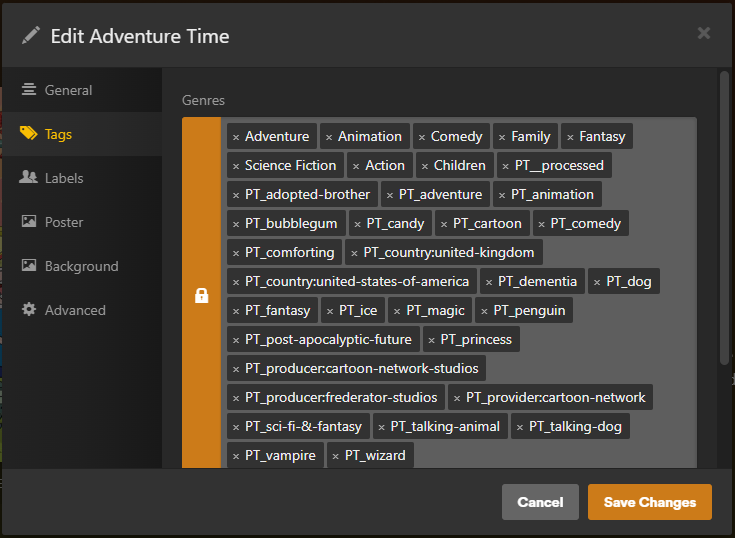

# plextagger

Script to generate tags on plex media.



## Usage


```sh
# run directly
python -m plextagger

# run using docker
docker build --tag 'plextagger' .
docker run --env-file .env plextagger

# use prebuilt image
docker run --env-file .env registry.gitlab.com/haondt/cicd/registry/plextagger:latest
```

#### Docker compose

```yml
services:
  plextagger:
    image: registry.gitlab.com/haondt/cicd/registry/plextagger:latest
    volumes:
      - plextagger_data:/data
    environment:
      PLEX_URL: http://plex:32400
      PLEX_TOKEN: "<your plex token>"
      TMDB_API_KEY: "<your tmdb api key>"
      SECTION_BATCH_SIZE: "25"
      SCHEDULE_MINUTES: "60"
      DB_PATH: /data
volumes:
  plextagger_data:
```

## Configuration

Config is done through env vars.

- `PLEX_URL` - url for plex server
- `PLEX_TOKEN` - plex api token
- `LOG_LEVEL` (`WARN`, `INFO`, `DEBUG`, etc) - log level
- `LOG_TEMPLATE` - override the python logging template
- `DB_PATH` - directory in which to store the sqlite db
- `TMDB_API_KEY` - api key for themoviedb
- `SECTION_BATCH_SIZE` - how big of a batch to use in a single run, per section
- `SCHEDULE_MINUTES` - time between runs

## Details

When using the docker image, the script will go through every movie/tv show section in your library. It will grab `SECTION_BATCH_SIZE` items from the section, that don't have the `PT__processed` genre. Then it will process them and add all the relevant tags, prefixed with `PT_`, including the `_processed` tag. Then it will wait `SCHEDULE_MINUTES` minutes before running again.